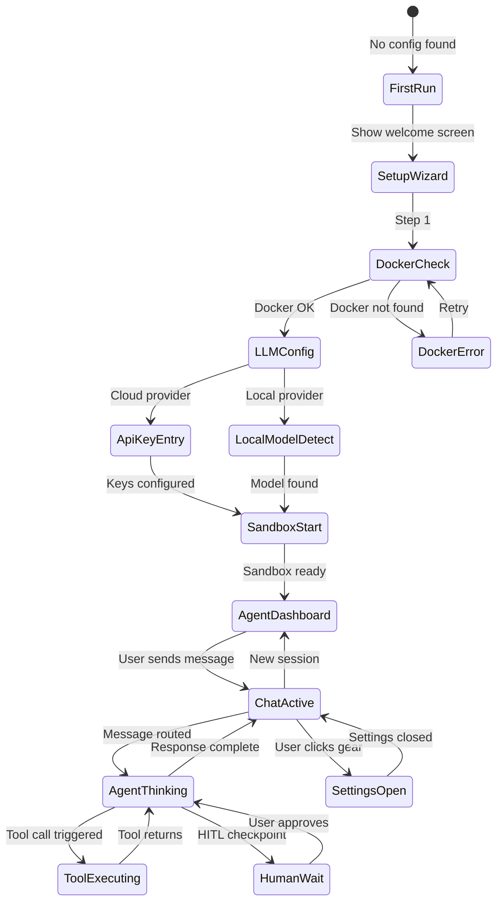

# Project Aegis — Design Guide v1.0

> **Design Language:** "Neo-Glass Terminus"
> A fusion of modern glassmorphism, terminal-inspired typography, and cybernetic accent lighting

---

## Table of Contents

1. [Design Philosophy & Identity](#1-design-philosophy--identity)
2. [Visual Language](#2-visual-language)
3. [Screen Architecture & Layout](#3-screen-architecture--layout)
4. [Component Library](#4-component-library)
5. [Interaction & Behavior](#5-interaction--behavior)
6. [Motion & Feedback](#6-motion--feedback)
7. [Accessibility (WCAG 2.2 AA)](#7-accessibility-wcag-22-aa)
8. [Empty, Error & Edge Case States](#8-empty-error--edge-case-states)
9. [Implementation Feasibility](#9-implementation-feasibility)
10. [UI/UX Glossary](#10-uiux-glossary)
11. [Binary Size Budget](#11-binary-size-budget)
12. [Team Feedback Collection — Q&A](#12-team-feedback-collection)

---

## 1. Design Philosophy & Identity

### 1.1 Design Identity

**"Neo-Glass Terminus"** — A design language that bridges the warmth of glassmorphism with the precision of terminal UIs. The app feels like a high-end developer tool that belongs in a sci-fi control room, not yet another generic productivity app.

| Aspect | Definition |
|--------|-----------|
| **Mood** | Dark, focused, powerful yet approachable |
| **Inspiration** | Agent Zero (navbar/icons), Warp terminal (glass effects), Linear (micro-interactions), Arc browser (sidebars) |
| **Differentiator** | Frosted glass panels over monospace terminal backdrops, with electric accent lighting |
| **Vibe** | "A brain interface for AI — clean glass over digital terminals" |

### 1.2 Core Design Principles

| # | Principle | Explanation |
|---|-----------|-------------|
| 1 | **Glass over Terminal** | Surfaces are semi-transparent frosted glass panels floating over a terminal-dark backdrop. The terminal code is always faintly visible underneath. |
| 2 | **Electric Accents** | Purple-violet primary (#8b5cf6) as the "AI signal" color. Use sparingly — it lights up only for AI activity, selections, and key UI. |
| 3 | **Monospace First** | Monospace font (JetBrains Mono) is the default for all agent chat text, not just code blocks. Gives a developer-native feel. Sans-serif for nav elements only. |
| 4 | **Depth Through Frost** | Z-depth is communicated by glass opacity/blur, not box shadows. Closer panels are more opaque; deeper layers are more blurred. |
| 5 | **Status as Light** | Never use colored badges. Use glowing dots, rings, or light washes. Agent status = colored glow emanating from the avatar. |
| 6 | **Motion with Purpose** | Every animation communicates state. Nothing moves "just because." AI thinking = pulsing glass ripple. Tool executing = progress arc. |
| 7 | **Streaming is Alive** | LLM token streaming renders with a cursor that feels alive — a gentle trailing glow rather than a blinking block. |
| 8 | **Dark-First, Light Aware** | Dark mode is the identity. Light mode strips away glass effects and becomes a crisp, clean alternative — but the app is designed for dark. |

### 1.3 Dark-First Mandate

- Dark mode is the **default and primary identity**
- Light mode is an **accessibility toggle only** (for users with visual impairments who need high contrast in bright environments)
- Light mode removes glass effects and becomes a clean white-on-dark-surface look
- `prefers-color-scheme` is respected for initial detection, but the user can override

### 1.4 Canvas Constraints

| Platform | WebView | Constraint |
|----------|---------|------------|
| Windows | WebView2 (Edge Chromium) | Full CSS support inc. backdrop-filter |
| macOS | WKWebView | backdrop-filter supported since Safari 15 |
| Linux | WebKitGTK | backdrop-filter varies; provide fallback |

---

## 2. Visual Language

### 2.1 Color System

#### Dark Palette (Primary Identity)

```
Token                  Hex       Usage                          Contrast on #0D0D0F
────────────────────── ───────── ────────────────────────────── ─────────────────
--bg-deep              #0D0D0F   Deepest background (below     —
                                   panels, visible through
                                   glass gaps)
--bg-glass             #1A1A24/85 Frosted glass surface          —
--bg-glass-elevated    #1E1E2A/92 Elevated glass (modals,       —
                                   dialogs)
--bg-glass-hover       #242430/92 Glass hover state              —
--border-glass         #2A2A3A/50 Glass panel borders            —
--border-glass-light   #3A3A4E/60 Stronger borders (active)     —

--text-primary          #E4E4E7   Body text                     14.5:1 ✓
--text-secondary        #A1A1AA   Labels, captions, metadata    7.2:1  ✓
--text-muted            #6B6B7A   Placeholder, disabled          4.8:1  ✓
--text-code             #C8C8D8   Code text in panels            12.1:1 ✓

--accent-purple         #8B5CF6   Primary accent — AI signal     7.0:1  ✓
--accent-purple-soft    #6D28D9   Hover/dark variant             4.6:1  ✓
--accent-purple-glow    #A78BFA   Glow effect color              9.2:1  ✓

--status-online         #22C55E   Agent online/green             5.8:1  ✓
--status-thinking       #8B5CF6   Agent thinking/processing      7.0:1  ✓
--status-warning        #F59E0B   Warning, attention needed      6.9:1  ✓
--status-error          #EF4444   Error, critical                5.6:1  ✓
--status-neutral        #6B7280   Offline, inactive               4.8:1  ✓
--status-human-wait     #3B82F6   Waiting for human input        6.2:1  ✓
```

#### Light Palette (Accessibility Toggle)

```
Token                  Hex       Usage
────────────────────── ───────── ──────────────────────────────
--bg-deep              #F8F9FA   Light backdrop
--bg-glass             #FFFFFF   White surface (no glass effect)
--bg-glass-elevated    #F0F1F3   Elevated surface
--text-primary          #1F2937   Body text
--text-secondary        #6B7280   Secondary text
--accent-purple         #7C3AED   Purple accent (slightly darker)
--status-online         #16A34A   Green
--status-error          #DC2626   Red
```

### 2.2 Typography

| Role | Font | Weight Range | Size Range | Fallback |
|------|------|-------------|------------|----------|
| **UI / System** | Geist (Variable) | 400–700 | 12px–16px | -apple-system, Segoe UI |
| **Headings** | Instrument Sans | 500–700 | 14px–28px | Geist |
| **Code / Terminal** | JetBrains Mono | 400–700 | 12px–16px | Cascadia Code, Fira Code |
| **Agent Chat Text** | JetBrains Mono | 400 | 14px | Fira Code |

**Why monospace for agent chat?**
- Gives the app a distinctive, developer-native feel
- Code, JSON, markdown table outputs render correctly without font switching
- Visually separates Aegis from every other chat AI interface
- The user specifically wants something different from the "same old" designs

### 2.3 Iconography

| Icon Set | Usage | Size Tokens |
|----------|-------|-------------|
| **Lucide** (tree-shaken) | Standard UI: chevron, X, search, settings, terminal, file | 16px (nav/body), 20px (buttons), 24px (headers) |
| **Custom SVG sprite** | App-specific: agent states, sandbox, tool types, phase icons | Following same tokens |

**Agent status icons** — Use custom glyphs, not generic dots:
- `◉` Online/idle — filled circle with glow
- `◐` Thinking — half-rotating circle
- `◎` Gathering context — concentric circles
- `⚡` Running tool — lightning bolt
- `⚠` Error — warning triangle
- `✋` Awaiting human — hand/pause icon

### 2.4 Spacing & Layout Grid

```
Base unit: 4px

Spacing scale:
  4px   —  1 unit (micro-gaps, inline icons)
  8px   —  2 units (stacked elements, button padding)
  12px  —  3 units (panel padding, form gaps)
  16px  —  4 units (section padding, card padding)
  20px  —  5 units (large padding, modal content)
  24px  —  6 units (section gaps)
  32px  —  8 units (major section separation)
  48px  — 12 units (page-level margins)
```

### 2.5 Glass Effects & Elevation

| Token | backdrop-filter | Opacity | Usage |
|-------|-----------------|---------|-------|
| `--elevation-base` | blur(8px) | 85% | Default panel surface |
| `--elevation-raised` | blur(12px) | 92% | Active panel, hover state |
| `--elevation-overlay` | blur(16px) | 95% | Modals, dialogs, popovers |
| `--elevation-tooltip` | blur(20px) | 98% | Tooltips, floating elements |

**Fallback for Linux WebKit:** When `backdrop-filter` is unsupported, fall back to solid `--bg-deep` colored surfaces with no glass effect. The design still works — it just loses the glass texture.

---

## 3. Screen Architecture & Layout

### 3.1 Window Anatomy

```
╔══════════════════════════════════════════════════════════════════════════╗
║  NAVBAR (36px)                                                          ║
║  ┌──────────────┐ ┌─────────────────────────────────────────┐ ┌──────┐ ║
║  │ ▲ Aegis      │ │ ◉ Agent Online  │  🤖 gpt-4o  │ 🔒    │ │ ⚙ □ ×│ ║
║  │              │ │         local provider  ├ sandbox      │ │      │ ║
║  └──────────────┘ └─────────────────────────────────────────┘ └──────┘ ║
╠══════════╤════════════════════════════════════════════╤══════════════════╣
║ SIDEBAR  │           MAIN PANEL                      │ RIGHT PANEL     ║
║ (48px)   │                                           │ (optional,      ║
║        ──┤                                           │  phase 2)      ║
║ Agents   │   ┌─────────────────────────────────────┐ │ ────────────    ║
║ ───────  │   │  Chat Message — User               │ │ Agent Details   ║
║ ◉ Alpha  │   │  ┌─ Code Block ──────────────────┐ │ │ ──────────      ║
║ ◯ Beta   │   │  │ def hello():                  │ │ │ Status: ◉ Active║
║ ◯ Gamma  │   │  │     print("hi")                │ │ │ Model: gpt-4o  ║
║          │   │  └────────────────────────────────┘ │ │ Tools: 5       ║
║ Sessions │   │  ── Tool Call: search_files ─────── │ │ Duration: 4m   ║
║ ───────  │   │  Input: pattern="*.rs"              │ │ ──────────      ║
║ Today    │   │  Output: [src/main.rs, ...] (3)     │ │ Recent Tools    ║
║ ├ ● Proj  │   │  Duration: 0.3s                    │ │ ./ src/...      ║
║ ├ ○ Debug│   │  ┌─ Agent Status ─────────────────┐ │ │ Latest: T-12s  ║
║ │         │   │  │ ◐ Thinking  ████████░░ 68%    │ │ │                 ║
║ Yesterday │   │  └────────────────────────────────┘ │ │                 ║
║ ├ ○ Refac │   │                                      │ │                 ║
║ └──       │   └──────────────────────────────────────┘ │                 ║
║           │                                           │                 ║
║ [+ New]   │                                           │                 ║
╠═══════════╧════════════════════════════════════════════╧═════════════════╣
║ BOTTOM DRAWER  [Logs] [Terminal] [Telemetry]  ▲ Collapsed  Alt+`       ║
║  2026-07-07 12:34:56  [INFO]  Agent Alpha starting...                    ║
║  2026-07-07 12:34:57  [TOOL]  Agent Alpha → search_files(pattern="*.rs") ║
╚══════════════════════════════════════════════════════════════════════════╝
```

### 3.2 Persistent Frame Elements

#### Navbar (36px height)

| Element | Content | Interaction |
|---------|---------|-------------|
| **App icon + name** | ▲ Aegis (SVG logo, left-aligned) | Click → home/dashboard |
| **Agent status** | ◉ Agent Name (with glow dot) | Click → agent switcher dropdown |
| **Privacy badge** | 🔒/🔓 green=lokl, yellow=cloud | Tooltip: provider name + type |
| **Sandbox status** | Docker icon + green/yellow/red dot | Click → sandbox details |
| **Settings** | ⚙ gear icon | Click → settings drawer/overlay |
| **Window controls** | — □ × | Custom minimize/maximize/close |

The navbar has `data-tauri-drag-region` for window dragging.

#### Sidebar (48px expanded, icon-only collapsible to 36px)

| Section | Content |
|---------|---------|
| **Agent roster** | Icons with status glow dots for each agent in the active network |
| **Session timeline** | Chat sessions grouped by date, with active session highlighted |
| **+ New** | Button to start a new session |
| **Bottom** | Settings / Preferences icon |

#### Main Panel (flexible width, fills remaining space)

- Primary content area
- Default: Chat view with message thread + input at bottom
- Alternate: Agent dashboard / overview (when no active chat)
- Can be replaced by settings view, first-run wizard, etc.

#### Bottom Drawer (collapsible, max 40vh)

| Tab | Content |
|-----|---------|
| **Logs** | Filterable event stream (agent actions, tool calls, system events) |
| **Terminal** | Embedded terminal into the Docker sandbox (via xterm.js + websocket) |
| **Telemetry** | Agent performance stats, token counts, tool timing, cost estimates |

Hotkey: `Ctrl+`` (backtick) to toggle.

### 3.3 Screen Flow Map



### 3.4 Component Tree

```
<App>
├── <Titlebar>                      Custom drag region + window controls
│   ├── <AppLogo />                 ▲ Aegis SVG
│   ├── <AgentStatusBar />          Active agent + status dot
│   ├── <PrivacyBadge />            🔒 Local / ☁ Cloud
│   ├── <SandboxIndicator />        Docker container health
│   └── <SettingsButton />          ⚙
├── <SplitLayout>
│   ├── <Sidebar>
│   │   ├── <AgentRoster>
│   │   │   └── <AgentSlot> (×N)   Icon + glow dot + phase icon
│   │   ├── <SessionList>
│   │   │   ├── <SessionGroup />    "Today", "Yesterday"
│   │   │   └── <SessionItem /> (×N)
│   │   └── <NewSessionButton />    [+ New]
│   ├── <MainPanel>
│   │   ├── <ChatView>              Default view
│   │   │   ├── <MessageThread>
│   │   │   │   ├── <UserMessage />
│   │   │   │   ├── <AgentMessage>
│   │   │   │   │   ├── <StreamingText />
│   │   │   │   │   ├── <CodeBlock />
│   │   │   │   │   └── <ToolCallAccordion />
│   │   │   │   └── <AgentPhaseIndicator />
│   │   │   └── <ChatInput />
│   │   │       ├── <TextArea />
│   │   │       └── <SendButton />
│   │   ├── <AgentDashboard />     Fallback view (no active chat)
│   │   └── <SettingsView />       Overlays main panel
│   └── <RightPanel>                Optional (phase 2+)
├── <BottomDrawer>
│   ├── <DrawerTabBar />            [Logs] [Terminal] [Telemetry]
│   ├── <LogStream />
│   ├── <Terminal />
│   └── <TelemetryPanel />
└── <OverlayStack>
    ├── <Modal />                   Generic modal container
    ├── <Toast /> (×N)              Notification stack
    ├── <ApprovalDialog />          HITL checkpoint
    └── <FirstRunWizard />          Stepper overlay
```

---

## 4. Component Library

### 4.1 Atomic Components

#### Button

| Variant | Visual | Usage |
|---------|--------|-------|
| **primary** | Purple glass with glow | Primary actions (Send, Confirm) |
| **secondary** | Subtle glass with border | Secondary actions (Cancel, Back) |
| **ghost** | Transparent, text-only | Toolbar actions, inline links |
| **danger** | Red glass | Destructive actions (Delete, Kill) |
| **icon** | Square, ghost-style | Toolbar icons |
| **link** | Text with accent underline | Navigational links |

States: `default | hover | active | disabled | loading`

#### Input & Textarea

- Glass surface with thin accent border on focus
- Placeholder text in `--text-muted`
- Character count optional
- Error state: red border + error message below

#### Badge & Tag & Status Dot

| Component | Variants |
|-----------|----------|
| Badge | `info`, `success`, `warning`, `error`, `neutral` |
| Tag | Add/remove pattern for filter chips |
| Status Dot | `▸◉` online, `◐` thinking, `●` offline, `⚠` error, `✋` waiting |

### 4.2 Compound Components

#### Chat Message

| Variant | Visual | Left Accent |
|---------|--------|-------------|
| **User** | Glass panel, no glow | Gray left border |
| **Agent** | Glass panel with purple glow | Purple left border + streaming cursor |
| **System** | Muted, compact | No border, smaller text |
| **Tool Call** | Expandable accordion embedded in chat | Yellow left border |
| **Error** | Red-tinted glass border | Red left border |

#### Code Block

```
┌──────────────────────────────────────────────┐
│ 📄 main.rs                    [Copy] [Run]   │
│ fn main() {                                  │
│     println!("Hello, Aegis!");                │
│ }                                             │
│ Line 1-10 ───                                 │
└──────────────────────────────────────────────┘
```

- Monospace font (JetBrains Mono)
- Syntax highlighting (lightweight, no Prism/Shiki for v1 — use simple tokenization)
- File name tag in header
- Copy + Run action buttons
- Line count indicator at bottom

#### Agent Card

```
┌──────────────────────────────────────────────┐
│  ◉ Alpha   ● Active   🤖 gpt-4o  ⚡ 1 tool  │
│  ──────────────────────────────────────────   │
│  ◐ Thinking: "Searching project files..."     │
│  ████████░░ 68%                               │
│  Last activity: 12s ago                        │
│  Session: "Refactor API routes"               │
└──────────────────────────────────────────────┘
```

#### Tool Call Accordion

```markdown
── Tool Call: search_files ─────────────────────
▶ Input:  pattern="*.rs", root="/workspace"
▶ Output: [src/main.rs, src/lib.rs, ...] (3 files)
  Duration: 0.3s  Status: ✅ Success
────────────────────────────────────────────────
```

Collapsed by default. Expand to see full input/output. Duration shown as a mini-badge.

### 4.3 Overlay Components

#### Modal & Dialog

- Glass elevated surface with backdrop blur
- Title, content, action buttons
- Escape to close, click-outside to close
- Focus trap for accessibility

#### Toast & Notification Banner

| Type | Color | Icon | Timeout |
|------|-------|------|---------|
| success | Green | ✓ | 4s |
| error | Red | ✗ | Persistent |
| warning | Yellow | ⚠ | 8s |
| info | Blue | ℹ | 6s |

Stacked at bottom-right, above the drawer.

#### Approval Dialog (HITL Checkpoint)

```
┌──── Human-in-the-Loop Required ──────────────┐
│                                              │
│  ✋ The agent wants to:                       │
│  "Delete file src/old_routes.rs"              │
│                                              │
│  [Review Files]  [Approve]  [Deny]           │
│                                              │
│  ⏱ Auto-denying in 45 seconds                │
└──────────────────────────────────────────────┘
```

- 60-second countdown timer
- Default-deny (auto-reject at timeout)
- No "approve all future" toggle (per Security Engineer's requirement)
- Emergency kill button

#### First-Run Wizard

- 4-step stepper overlay on first launch
- Steps: Welcome → Docker Check → LLM Setup → Agent Config
- Each step has inline help text + retry buttons for failures
- Skip button for experienced users

---

## 5. Interaction & Behavior

### 5.1 Chat Interaction Model

1. User types message in input
2. Message appears immediately as a user bubble
3. Agent starts thinking: avatar glow pulse + phase indicator in navbar
4. Token stream renders in real-time with `insertAdjacentText`
5. If tool call: accordion appears inline, expands on click
6. Response complete: glow transitions to steady-on, new input enabled

### 5.2 Agent Lifecycle UI Mapping

| AgentKit Phase | UI State | Phase Icon | Visual Feedback |
|----------------|----------|------------|-----------------|
| `idle` | Online | ◉ | Steady green dot |
| `thinking` | Thinking | ◐ | Purple glow pulse on avatar |
| `gathering_context` | Searching | ◎ | Concentric ring animation |
| `running_tool` | Executing | ⚡ | Lightning icon with progress |
| `reviewing_output` | Reviewing | ◉ | Spinning ring (inward) |
| `error` | Error | ⚠ | Red glow + error toast |
| `awaiting_human` | Waiting | ✋ | Blue glow + approval dialog |

### 5.3 Tool Call Streaming UX

- Tool call accordion appears as soon as agent calls a tool
- Shows animated input construction for streaming tool args
- Result panel has an inline mini progress bar (0% → 100%)
- Failed tool calls: red highlight + error message + retry button

### 5.4 Sidebar Navigation & Session Management

- Click agent slot → switch active agent (right panel updates)
- Click session → load that session's chat history
- Sessions are auto-saved in Tauri backend state
- Sessions are grouped by date (Today, Yesterday, This Week, Older)
- Right-click session → Rename, Delete, Export

### 5.5 Keyboard Shortcuts Catalog

| Shortcut | Action |
|----------|--------|
| `Ctrl+Enter` | Send message |
| `Ctrl+`` | Toggle bottom drawer |
| `Ctrl+Shift+1-9` | Switch active agent |
| `Ctrl+K` | Command palette |
| `Ctrl+Shift+N` | New session |
| `Ctrl+,` | Open settings |
| `Escape` | Close modal / cancel |
| `Ctrl+Shift+C` | Copy last code block |

---

## 6. Motion & Feedback

### 6.1 Loading State Patterns

| Pattern | When |
|---------|------|
| **Skeleton glass** | Panel loading (shimmer across frosted glass) |
| **Pulsing glow** | Agent thinking (avatar border glow pulses) |
| **Dot progress** | Tool execution (3 dots in sequence) |
| **Spinning ring** | Reviewing/processing |

### 6.2 Agent "Thinking" Animation

```css
@keyframes agent-think {
  0%   { box-shadow: 0 0 4px rgba(139, 92, 246, 0.4); }
  50%  { box-shadow: 0 0 12px rgba(139, 92, 246, 0.8); }
  100% { box-shadow: 0 0 4px rgba(139, 92, 246, 0.4); }
}
```

The agent avatar border glows with a slow 2s pulse while the agent is thinking.

### 6.3 Streaming Token Cursor

```css
@keyframes cursor-breath {
  0%, 100% { opacity: 0.6; text-shadow: 0 0 4px var(--accent-purple-glow); }
  50%      { opacity: 1;   text-shadow: 0 0 8px var(--accent-purple-glow); }
}
````

A gentle `▎` cursor with breathing glow — not a harsh blink.

### 6.4 Transition Tokens

| Token | Duration | Easing | When |
|-------|----------|--------|------|
| `--ease-fast` | 150ms | ease-out | Hover, micro-interactions |
| `--ease-normal` | 200ms | ease-in-out | Panel transitions, drawer |
| `--ease-slow` | 300ms | ease-out | Agent phase transitions |
| `--ease-glass` | 400ms | ease-in | Glass blur transitions |

---

## 7. Accessibility (WCAG 2.2 AA)

### 7.1 Color Contrast Verification

| Token Pair | Ratio | Pass (AA) |
|------------|-------|-----------|
| `--text-primary` (#E4E4E7) on `--bg-deep` (#0D0D0F) | 14.5:1 | ✅ |
| `--text-secondary` (#A1A1AA) on `--bg-glass` (#1A1A24) | 7.2:1 | ✅ |
| `--accent-purple` (#8B5CF6) on `--bg-glass` (#1A1A24) | 7.0:1 | ✅ |
| `--status-error` (#EF4444) on `--bg-glass` (#1A1A24) | 5.6:1 | ✅ |
| `--status-online` (#22C55E) on `--bg-glass` (#1A1A24) | 5.8:1 | ✅ |

### 7.2 Keyboard Navigation Map

| Tab Order | Element | Notes |
|-----------|---------|-------|
| 0 | Skip to content link | Hidden, visible on focus |
| 1 | App title/link | Home navigation |
| 2 | Agent switcher | Dropdown |
| 3-7 | Sidebar agent slots | Arrow keys to navigate |
| 8 | Chat input | Primary action point |
| 9 | Send button | |
| 10 | Bottom drawer toggle | |
| N | Settings | Via gear icon |

### 7.3 Screen Reader Targets

- All icon-only buttons: `aria-label`
- Chat area: `role="log"` + `aria-live="polite"`
- Agent status changes: `role="status"` + `aria-live="assertive"`
- Streaming text: `aria-busy="true"` while streaming, `aria-busy="false"` when complete
- Code blocks: `role="code"`
- Tool calls: `role="region"` + `aria-label="Tool: [name]"`

### 7.4 Reduced Motion

- All animations respect `prefers-reduced-motion: reduce`
- No pulsing glows, no breathing cursors — static indicators only
- Streaming text renders instantly, no animated cursor

---

## 8. Empty, Error & Edge Case States

### 8.1 Empty States

| Panel | Empty State |
|-------|-------------|
| **Chat** | "Send a message to start working with your AI agent" + example prompts |
| **Agent roster** | Single default agent auto-created |
| **Logs** | "No log entries yet. Agent activity will appear here." |
| **Terminal** | "Terminal connected to sandbox. Type a command or wait for agent output." |
| **Sessions** | "No previous sessions. Your chat history will appear here." |
| **Settings (no API key)** | Warning: "No LLM provider configured. Add an API key in Settings." |

### 8.2 Error States

| Error | UX Pattern |
|-------|------------|
| **Docker not installed** | First-run wizard: show install link + retry button |
| **Docker not running** | Non-blocking warning banner + one-click "Start Docker" button |
| **API key missing** | Settings badge turns red + tooltip + auto-navigate to settings |
| **Agent crash/timeout** | Error toast + agent slot shows ⚠ with retry |
| **LLM connection failure** | Error message in chat + retry button + fallback suggestion |
| **Workspace permission denied** | Error dialog with path + fix suggestion |
| **IPC connection lost** | "Sandbox disconnected" overlay + reconnect button |

---

## 9. Implementation Feasibility

### 9.1 Recommended Stack

| Layer | Technology | Binary Cost (gzip) |
|-------|-----------|-------------------|
| CSS | CSS Modules + Custom Properties + Open Props subset | ~40KB |
| UI Libs | Radix UI primitives (~25KB) + Floating UI (~8KB) + Framer Motion subset (~35KB) | ~68KB |
| Virtual scroll | @tanstack/react-virtual (~10KB) | ~10KB |
| Fonts | Geist (30KB) + JetBrains Mono (40KB) + Instrument Sans (25KB) — all .woff2 | ~95KB |
| Icons | Lucide (tree-shaken) + custom SVG sprite | ~5KB |
| Layout | CSS Grid + `allotment` for split panes | ~1KB |
| **Total frontend additions** | | **~219KB** |

### 9.2 Implementation Risks

| Risk | Impact | Likelihood | Mitigation |
|------|--------|------------|------------|
| Custom titlebar breaks on Linux | Medium | Low | Test Gnome/KDE; `decorations: false` fallback |
| Streaming jank with burst tokens | Low | Medium | rAF caps at 60fps; batch every 50ms as fallback |
| WebView2 backdrop-filter unsupported | Medium | Low (WV2 auto-updates) | Solid color fallback via `@supports` |
| Radix Dialog portal escapes window | Medium | Low | Floating UI `autoUpdate` on boundary collision |
| Font flash (FOUT) on first load | Low | Low | `font-display: swap` + preload |

---

## 10. UI/UX Glossary

| Term | Definition |
|------|------------|
| **Agent** | An AI worker running inside the Docker sandbox, powered by AgentKit |
| **Agent Lifecycle** | State machine: idle → thinking → tool_exec → completing → done |
| **Bottom Drawer** | Collapsible panel for logs, terminal, telemetry |
| **Canvas** | Main content area where active view renders |
| **HITL** | Human-in-the-Loop — user must approve agent actions |
| **Neo-Glass Terminus** | The design language name for Aegis |
| **Phase Indicator** | Visual showing agent lifecycle state (glow pulse, icon) |
| **Privacy Badge** | 🔒=local provider, ☁=cloud provider — trust signal |
| **Sandbox** | Docker container isolating agent execution |
| **Session** | A single chat conversation from first message to reset |
| **Tool Call Accordion** | Expandable component showing tool input/output/duration |
| **Workspace** | Persistent directory mounted into sandbox for artifacts |

---

## 11. Binary Size Budget

| Layer | Budget | Notes |
|-------|--------|-------|
| Rust binary (LTO, stripped) | 3-5 MB | Release profile with `opt-level="z"` |
| Frontend JS bundle (Vite) | 600 KB | React 18 + Radix + Lucide + app code |
| Frontend CSS | 40 KB | Custom CSS Modules |
| Custom fonts | 100 KB | 3 variable .woff2 |
| Icons | 5 KB | Lucide tree-shaken |
| Docker image | ~200 MB | Not bundled — downloaded on demand |
| **Total Tauri bundle** | **~3.7-5.7 MB** | Well under 15 MB ceiling |

---

## 12. Team Feedback Collection

> *This section is for collecting feedback from the Aegis Dev Team.*

### Questions for the Team

1. **Visual Identity** — Does the "Neo-Glass Terminus" design language feel distinctive enough? Any concerns about glass effects on low-end hardware?

2. **Layout** — Single-window with sidebar (48px) + main panel + bottom drawer. Is the 48px sidebar too narrow? Should it expand to 280px on hover?

3. **Typography** — JetBrains Mono as the default for ALL agent chat text (not just code). Will this feel developer-native or too niche?

4. **Component Priorities** — Are any critical components missing for v1? Any we should cut?

5. **Right Panel** — Optional right panel for agent details. Should this be v1 or defer to v1.1?

6. **Custom Titlebar** — Is the cross-platform custom titlebar worth the effort, or should we use native decorations for v1?

7. **Accessibility** — Any WCAG concerns with the glass effect + contrast ratios?

8. **Implementation Order** — Should we build the layout shell first (Phase 1), or design tokens + component library first?

---

